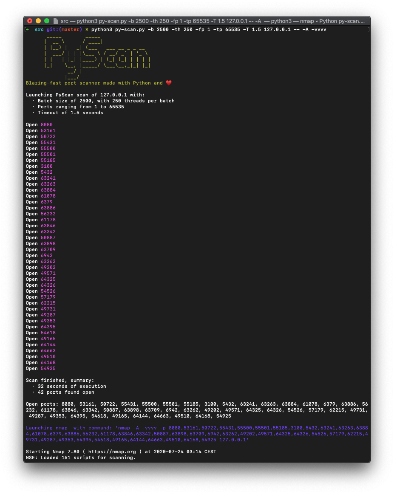

# PyScan
* Same as https://github.com/brandonskerritt/RustScan, but written in python and, usually, faster

## Requirements
* The only system requirements are python3 and nmap, no dependencies (YAY)
## Usage
`py-scan.py [-h] [-b BATCH] [-th BATCH_THREADS] [-fp FROM_PORT] [-tp TO_PORT] [-T TIMEOUT] ip_address  [nmap_command [nmap_command ...]]`
### Examples
`python3 py-scan.py 127.0.0.1`  
`python3 py-scan.py -b 2500 -th 250 -fp 1 -tp 65535 -T 1.5 127.0.0.1 -- -A -vvvv`
